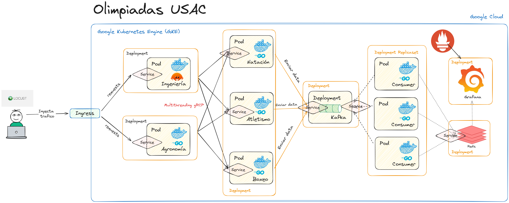

[espanish-docs](./docs/es/Readme.md)


# Statement

This example microservices project focuses on monitoring the Olympics of the University of San Carlos of Guatemala using an architecture based on microservices and containers, deployed on Google Cloud Platform (GCP) with Kubernetes.

### Objectives:
- **Deployment on GCP**: Use of Google Kubernetes Engine (GKE) to manage the real-time traffic generated by the competition.
- **Use of gRPC**: Communication between microservices using gRPC.
- **Microservices in Golang and Rust**: Services for faculties and disciplines implemented in Golang and Rust, with communication through gRPC.
- **Kafka and Redis**: Use of Apache Kafka for the transmission of events of winning and losing students, and Redis for temporary storage of results.
- **Monitoring in Grafana and Prometheus**: Data visualization in Grafana and resource monitoring with Prometheus.

### Key Components:
1. **Locust Traffic Generation**: Traffic simulation that directs data to the Kubernetes Ingress.
2. **Faculty Microservices**: Services that receive student requests and direct them to the corresponding discipline servers.
3. **Discipline Microservices**: These decide if a student is a winner or loser and send the results to Kafka.
4. **Consumption and Visualization**: Data processed by Kafka consumers is stored in Redis, and visualized in real time by Grafana.

This example illustrates the management and automatic scaling of distributed cloud services, adapting to high traffic demands using a container infrastructure and microservices architecture.

### Requirements:
- GCP with a valid Google Cloud Platform (GCP) account.
- Basic knowledge of Kubernetes and Docker.
- Basic knowledge of Kafka and Redis.
- Basic knowledge of Golang and Rust.
- Basic knowledge of Prometheus and Grafana.
- gRPC.
- Linux or macOS.
- Gcloud.
- Kubectl.
- Docker.
- Helm.

## Architecture:


---

## [Detailed documentation of the software used](./docs/en/Deploys.md)

See the list of software technologies used for the project in GKE

---
# Steps to implement the project
The recommended number of nodes is 3 to be able to manage the traffic load of the competition. This project uses a 6-node cluster so that they can be scaled to a higher level of traffic.

1. Create a Kubernetes cluster in GCP:
```bash
gcloud container clusters create project2 --num-nodes=6 --region=us-west1-a --tags=allin,allout --machine-type=e2-medium --no-enable-network-policy --disk-size=25GB --disk-type pd-standard
```

2. Apply the sopes1 namespace from the beginning of the cluster:
```bash
# namespace in this proyect: sopes1 
kubectl apply -f namespace.yaml
```

3. Set the namespace:
```bash
kubectl config set-context --current --namespace=sopes1
```

4. Apply the Strimzi:
```bash
kubectl create -f 'https://strimzi.io/install/latest?namespace=sopes1'
```

5. Apply the Kafka:
```bash
kubectl apply -f https://strimzi.io/examples/latest/kafka/kraft/kafka-single-node.yaml
```

6. Wait for Kubernetes to start the pods, services, etc. necessary:
```bash
kubectl wait kafka/my-cluster --for=condition=Ready --timeout=300s
```

7. Create the topics:
```bash
kubectl apply -f kafka_topics.yaml
```

* Try Kafka with a Producer for testing:
```bash
kubectl -n sopes1 run kafka-producer -ti --image=quay.io/strimzi/kafka:0.43.0-kafka-3.8.0 --rm=true --restart=Never -- bin/kafka-console-producer.sh --bootstrap-server my-cluster-kafka-bootstrap:9092 --topic my-topic
```

* Test Kafka with a Consumer for testing:
```bash
kubectl -n sopes1 run kafka-consumer -ti --image=quay.io/strimzi/kafka:0.43.0-kafka-3.8.0 --rm=true --restart=Never -- bin/kafka-console-consumer.sh --bootstrap-server my-cluster-kafka-bootstrap:9092 --topic student-losers --from-beginning
```


8. Apply gRPC deployments:
```bash
kubectl apply -f go_client.yaml
kubectl apply -f rust_client.yaml

kubectl apply -f go_servers.yaml
```

9. Apply Ingress:
```bash
kubectl apply -f ingress.yaml
```
It is recommended to wait a few seconds for Ingress to be ready.

10. Apply the Ingress Controller deployment:
```bash
kubectl apply -f ingress_controller.yaml
```

11. Apply Redis:
```bash
# With HELM
helm install custom-redis ./custom-redis --namespace sopes1

# With the yaml
kubectl apply -f redis.yaml

# Empty Redis if needed
kubectl exec -it [redis-pod-name] -n sopes1 -- redis-cli
```

12. Apply Kafka consumers:
```bash
kubectl apply -f kafka_consumers_losers.yaml
kubectl apply -f kafka_consumers_winners.yaml
```

13. Apply Grafana with HELM:
Note: To access the Grafana app, you must use the following command:

```bash
helm repo add grafana https://grafana.github.io/helm-charts
helm repo update

helm install grafana grafana/grafana -f grafana_values.yaml

# If you want to update the Grafana version:
helm upgrade grafana grafana/grafana -f grafana_values.yaml
```

User: admin
Password:
```bash
kubectl get secret --namespace sopes1 grafana -o jsonpath="{.data.admin-password}" | base64 --decode ; echo
```
IP:
```bash
kubectl get svc --namespace sopes1 -w grafana
```
IP: http://*see ip of the machine where the app is*

Variables to use in Grafana:
Redis: redis- service:6379
- *Losers by faculty*: ```faculty:*faculty*:lost```
- *Total students by faculty*: ```faculty:*faculty*:total```
- *Count by disciplines where the winners come from (number)*: ```discipline:*no-discipline*:winners```
- - 1 = Swimming, 2 = Athletics, 3 = Boxing

14. Apply prometheus:
```bash
helm install prometheus prometheus-community/prometheus --namespace monitoring --create- namespace
```