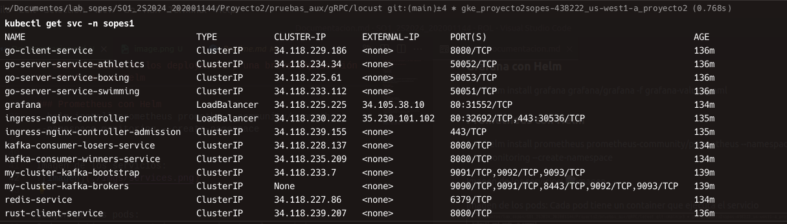
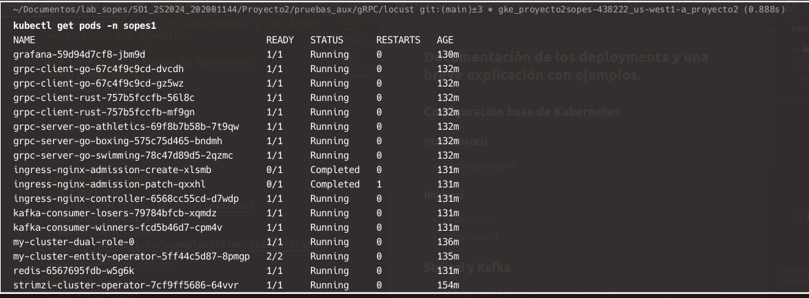
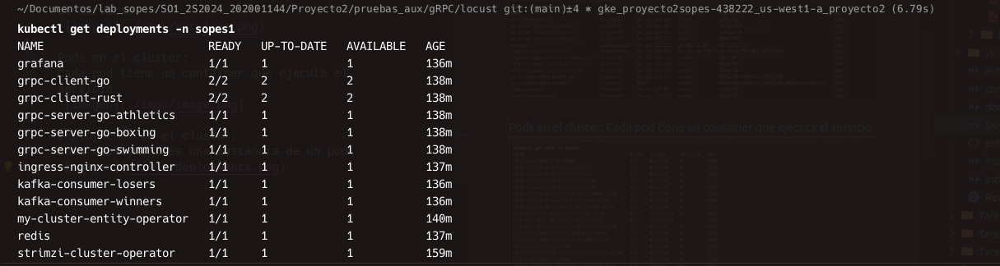
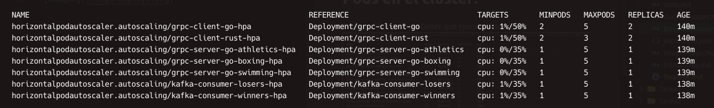

## Documentación de los deployments y una breve explicación con ejemplos.

### Configuracion base de Kubernetes
#### (Namespaces)
- namespace.yaml

#### (Ingress)
- deploy.yaml
- ingress.yaml

### Strimzi y Kafka
- strimzi.yaml 
('https://strimzi.io/install/latest?namespace=sopes1')
- kafka-topics.yaml 
(https://strimzi.io/examples/latest/kafka/kraft/kafka-single-node.yaml)

### Go Client
- go_client.yaml

### Go Server
- go_servers.yaml

### Rust Client
- rust_client.yaml

### Consumers
- consumers.yaml (losers)
- consumers2.yaml (winners)

### Redis con Helm
- helm install custom-redis ./custom-redis --namespace sopes1

### Grafana con Helm    
- helm install grafana grafana/grafana -f grafana-values.yaml

### Prometheus con Helm
- helm install prometheus prometheus-community/prometheus --namespace monitoring --create-namespace

# Servicios en el cluster:
Cada servicio tiene uno o unos pods que ejecutan el servicio.

# Pods en el cluster:
Cada pod tiene un container que ejecuta el servicio.

# Deployments en el cluster:
Cada deployment es una instancia de un pod.

# Horizontal Pod Autoscaler
