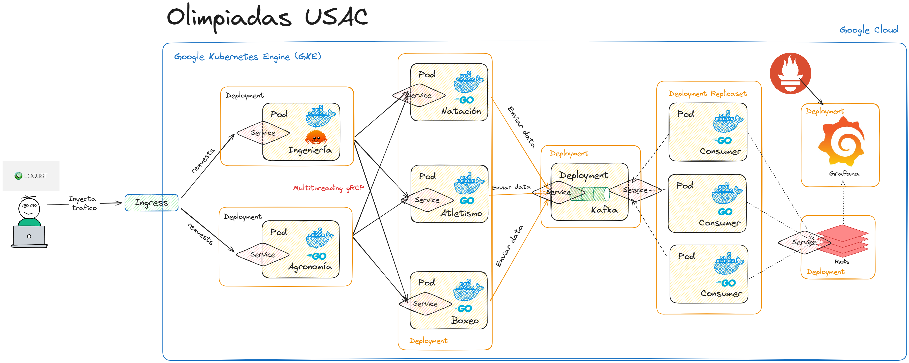

# Enunciado

Este proyecto de ejemplo de microservicios se centra en monitorizar las Olimpiadas de la Universidad de San Carlos de Guatemala mediante una arquitectura basada en microservicios y contenedores, desplegada en Google Cloud Platform (GCP) con Kubernetes.

### Objetivos:
- **Despliegue en GCP**: Utilización de Google Kubernetes Engine (GKE) para gestionar el tráfico en tiempo real generado por la competencia.
- **Usar gRPC**: Comunicación entre microservicios mediante gRPC.
- **Microservicios en Golang y Rust**: Servicios para facultades y disciplinas implementados en Golang y Rust, con comunicación mediante gRPC.
- **Kafka y Redis**: Uso de Apache Kafka para la transmisión de eventos de estudiantes ganadores y perdedores, y Redis para almacenamiento temporal de resultados.
- **Monitoreo en Grafana y Prometheus**: Visualización de datos en Grafana y monitoreo de recursos con Prometheus.

### Componentes Clave:
1. **Generación de tráfico con Locust**: Simulación de tráfico que dirige datos al Ingress de Kubernetes.
2. **Microservicios de facultades**: Servicios que reciben solicitudes de estudiantes y los dirigen a los servidores de disciplinas correspondientes.
3. **Microservicios de disciplinas**: Estos deciden si un estudiante es ganador o perdedor y envían los resultados a Kafka.
4. **Consumo y visualización**: Datos procesados por consumidores de Kafka se almacenan en Redis, y Grafana los visualiza en tiempo real.

Este ejemplo ilustra la gestión y escalado automático de servicios distribuidos en la nube, adaptándose a altas demandas de tráfico mediante una infraestructura de contenedores y arquitectura de microservicios.

### Requisitos:
- GCP con cuenta de Google Cloud Platform (GCP) válida.
- Conocimientos básicos de Kubernetes y Docker.
- Conocimientos básicos de Kafka y Redis.
- Conocimientos básicos de Golang y Rust.
- Conocimientos básicos de Prometheus y Grafana.
- gRPC.
- Linux o macOS.
- Gcloud.
- Kubectl.
- Docker.   
- Helm.

### Arquitectura:


---
# Documentacion del software utilizado a detalle:
[Deploys](./Deploys.md)

---
# Pasos para implementar el proyecto
El numero de nodos recomendado es de 3 para poder gestionar la carga de tráfico de la competencia. Este proyecto utiliza un cluster de 6 nodos para que puedan ser escalados a mayor nivel de tráfico.

1. Crear un cluster de Kubernetes en GCP:
```bash
gcloud container clusters create proyecto2 --num-nodes=6 --region=us-west1-a --tags=allin,allout --machine-type=e2-medium --no-enable-network-policy --disk-size=25GB --disk-type pd-standard
```

2. Aplicar el namespace de sopes1 desde el inicio del cluster:
```bash
kubectl apply -f namespace.yaml
```

3. Setear el namespace:
```bash
kubectl config set-context --current --namespace=sopes1
```

4. Aplicar el Strimzi:
```bash
kubectl create -f 'https://strimzi.io/install/latest?namespace=sopes1'
```

5. Aplicar el Kafka:
```bash
kubectl apply -f https://strimzi.io/examples/latest/kafka/kraft/kafka-single-node.yaml
```

6. Esperar a que Kubernetes inicie los pods, servicios, etc. necesarios:
```bash
kubectl wait kafka/my-cluster --for=condition=Ready --timeout=300s 
```

7. Crear los topics:
```bash
kubectl apply -f kafka_topics.yaml
```
 
* Probar Kafka con un Producer para realizar testeos:
```bash
kubectl -n sopes1 run kafka-producer -ti --image=quay.io/strimzi/kafka:0.43.0-kafka-3.8.0 --rm=true --restart=Never -- bin/kafka-console-producer.sh --bootstrap-server my-cluster-kafka-bootstrap:9092 --topic my-topic
```

* Probar Kafka con un Consumer para realizar testeos:
```bash
kubectl -n sopes1 run kafka-consumer -ti --image=quay.io/strimzi/kafka:0.43.0-kafka-3.8.0 --rm=true --restart=Never -- bin/kafka-console-consumer.sh --bootstrap-server my-cluster-kafka-bootstrap:9092 --topic student-losers --from-beginning
```


8. Aplicar los deployments de gRPC:
```bash
kubectl apply -f go_client.yaml
kubectl apply -f rust_client.yaml

kubectl apply -f go_servers.yaml
```

9. Aplicar el Ingress:
```bash
kubectl apply -f ingress.yaml
```
Se recomienda esperar unos segundos para que el Ingress esté listo.

10. Aplicar el deploy del Ingress Controller:
```bash
kubectl apply -f ingress_controller.yaml
```

11. Aplicar Redis:
```bash
# Con HELM
helm install custom-redis ./custom-redis --namespace sopes1

# Con el yaml
kubectl apply -f redis.yaml

# Vaciar Redis en caso de necesitarlo
kubectl exec -it [redis-pod-name] -n sopes1 -- redis-cli
```

12. Aplicar los consumidores de Kafka:
```bash
kubectl apply -f kafka_consumers_losers.yaml
kubectl apply -f kafka_consumers_winners.yaml
```

13. Aplicar Grafana con HELM:
Nota: Para acceder a la app de Grafana, debes usar el siguiente comando:

```bash
helm repo add grafana https://grafana.github.io/helm-charts
helm repo update

helm install grafana grafana/grafana -f grafana_values.yaml 


# En caso de querer actualizar la versión de Grafana:
helm upgrade grafana grafana/grafana -f grafana_values.yaml
```

Usuario: admin

Contraseña: 
```bash
kubectl get secret --namespace sopes1 grafana -o jsonpath="{.data.admin-password}" | base64 --decode ; echo
```
IP: 
```bash
kubectl get svc --namespace sopes1 -w grafana
```
IP: http://*ver ip de la máquina donde está la app*

Variables a usar en Grafana:
Redis: redis-service:6379
- *Perdedores por facultad*: ```facultad:*facultad*:perdidos```
- *Total de alumnos por facultad*: ```facultad:*facultad*:total```
- *Conteo por disciplinas de donde provienen los ganadores (numero)*: ```disciplina:*no-disciplina*:ganadores```
- - 1 = Swimming, 2 = Athletics, 3 = Boxing

14. Aplicar prometheus:
```bash
helm install prometheus prometheus-community/prometheus --namespace monitoring --create-namespace
```

